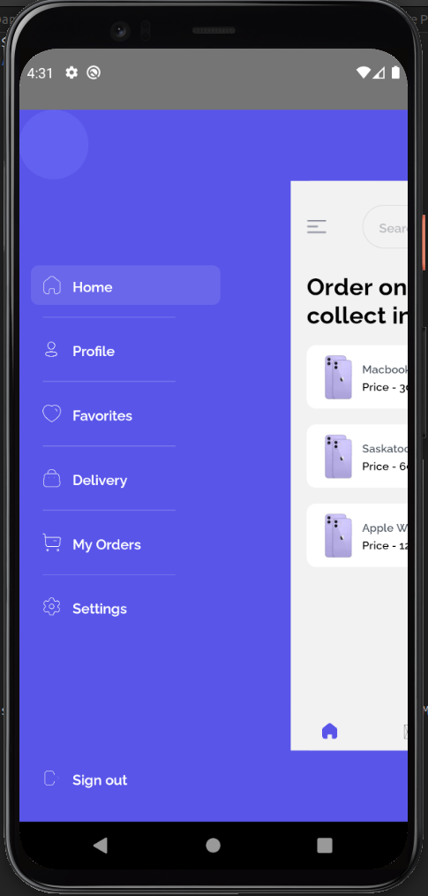

# Full Stack Ecommerce Application
The main objective of this project was to have a single code base for both web and mobile apps with the logic and view separated.


## Technology Used 
```
- Mobile 
  React Native CLI
  Redux
  Axios 

- API 
  Node 
  express

- Database 
  PostgreSQL

``` 
## API Dependencies

```
    "bcrypt": "^5.0.0",
    "compression": "^1.7.4",
    "cookie-parser": "^1.4.5",
    "cors": "^2.8.5",
    "crypto": "^1.0.1",
    "dotenv": "^8.2.0",
    "express": "^4.17.1",
    "express-async-errors": "^3.1.1",
    "helmet": "^4.4.1",
    "jsonwebtoken": "^8.5.1",
    "moment": "^2.29.1",
    "morgan": "^1.10.0",
    "pg": "^8.5.1",
    "pino": "^6.11.3",
 
```

## Mobile Dependencies
```
    "@react-native-async-storage/async-storage": "^1.15.14",
    "@react-navigation/bottom-tabs": "^6.0.9",
    "@react-navigation/drawer": "^6.1.8",
    "@react-navigation/native": "^6.0.6",
    "@react-navigation/native-stack": "^6.2.5",
    "@react-navigation/stack": "^6.0.11",
    "axios": "^0.24.0",
    "react": "17.0.2",
    "react-native": "0.66.4",
    "react-native-gesture-handler": "^2.1.0",
    "react-native-linear-gradient": "^2.5.6",
    "react-native-reanimated": "^2.3.1",
    "react-native-safe-area-context": "^3.3.2",
    "react-native-screens": "^3.10.1",
    "react-native-swipe-list-view": "^3.2.9",
    "react-redux": "^7.2.6",
    "redux": "^4.1.2",
    "redux-thunk": "^2.4.1"
```

## Application ScreenShots 

> OnBoarding 


> Authentication 


> Home 




